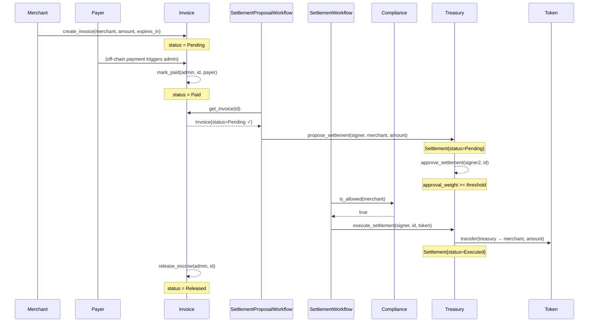

# Architecture

This document describes the protocol-level design of the three COMEBACKHERE smart contracts, their data storage, and how they interact during a typical payment lifecycle.

## Contracts

| Contract | Crate path | Responsibility |
|---|---|---|
| **Invoice** | `contracts/invoice` | Invoice state machine and escrow lifecycle |
| **Treasury** | `contracts/treasury` | 2-of-3 multi-sig settlement approval and token transfer |
| **Compliance** | `contracts/compliance` | Admin-managed allow/block list for addresses |

---

## Payment Lifecycle — Mermaid Sequence Diagram



> **Note:** `SettlementProposalWorkflow` and `SettlementWorkflow` are off-chain or intermediary contracts that coordinate the cross-contract calls. Treasury does **not** call Compliance directly.

---

## DataKey Storage Reference

### Invoice (`contracts/invoice`)

| DataKey | Storage | Type | Description |
|---|---|---|---|
| `Admin` | Instance | `Address` | Contract administrator |
| `InvoiceCount` | Instance | `u64` | Monotonic invoice ID counter |
| `Paused` | Instance | `bool` | Circuit-breaker flag |
| `GraceWindow` | Instance | `u64` | Seconds added to `expires_at` during `mark_paid` |
| `Invoice(u64)` | Persistent | `Invoice` | Full invoice record keyed by ID |
| `MerchantNonce(Address, u64)` | Persistent | `bool` | Idempotency guard; rejects duplicate merchant nonces |

### Treasury (`contracts/treasury`)

| DataKey | Storage | Type | Description |
|---|---|---|---|
| `Admin` | Instance | `Address` | Contract administrator |
| `Threshold` | Instance | `u32` | Minimum approval weight to execute a settlement |
| `SettlementCount` | Instance | `u64` | Monotonic settlement ID counter |
| `Signer(Address)` | Instance | `u32` | Signing weight per authorized signer |
| `Paused` | Instance | `bool` | Circuit-breaker flag |
| `DisputeCount` | Instance | `u64` | Monotonic dispute ID counter |
| `RotationCount` | Instance | `u64` | Monotonic signer-rotation proposal counter |
| `TokenAllowlist` | Instance | `Vec<Address>` | Approved token contracts for settlement |
| `MerchantPayoutAddress(Address)` | Instance | `Address` | Override payout address per merchant |
| `Settlement(u64)` | Persistent | `Settlement` | Settlement record keyed by ID |
| `Dispute(u64)` | Persistent | `Dispute` | Dispute record keyed by ID |
| `Balance(Address)` | Persistent | `i128` | Deposited balance per depositor |
| `SignerRotation(u64)` | Persistent | `SignerRotationProposal` | Signer rotation proposal keyed by ID |

### Compliance (`contracts/compliance`)

| DataKey | Storage | Type | Description |
|---|---|---|---|
| `Admin` | Instance | `Address` | Contract administrator |
| `PendingAdmin` | Instance | `Address` | Pending admin for two-step transfer |
| `Paused` | Instance | `bool` | Circuit-breaker flag (allow/block ops disabled; `block_address` still permitted) |
| `AddressIndex` | Instance | `Vec<Address>` | Index of all tracked addresses for `export_snapshot` |
| `Allowed(Address)` | Persistent | `bool` | Whether an address is on the allow-list |
| `Blocked(Address)` | Persistent | `bool` | Whether an address is blocked (overrides allow) |
| `AllowedUntil(Address)` | Persistent | `u64` | Optional expiry timestamp for a temporary allow |

---

## Cross-Contract Call Map

```
SettlementProposalWorkflow
  ├── Invoice::get_invoice(id)              → validates status == Pending
  └── Treasury::propose_settlement(...)     → creates Settlement record

SettlementWorkflow
  ├── Compliance::is_allowed(merchant)      → compliance gate (must be true)
  └── Treasury::execute_settlement(...)     → transfers tokens to merchant

Treasury::execute_settlement
  └── Token::transfer(treasury → merchant)  → SEP-41 token transfer

Invoice (standalone — no outbound cross-contract calls)
Treasury (standalone — no outbound cross-contract calls except Token)
Compliance (standalone — no outbound cross-contract calls)
```

### Invoice Status State Machine

```
Pending ──mark_paid──► Paid ──release_escrow──► Released
   │                     │
   │ cancel_invoice       └── request_refund ──► RefundRequested
   ▼
Cancelled

Pending ──batch_expire──► Expired  (when ledger.timestamp >= expires_at)
```
