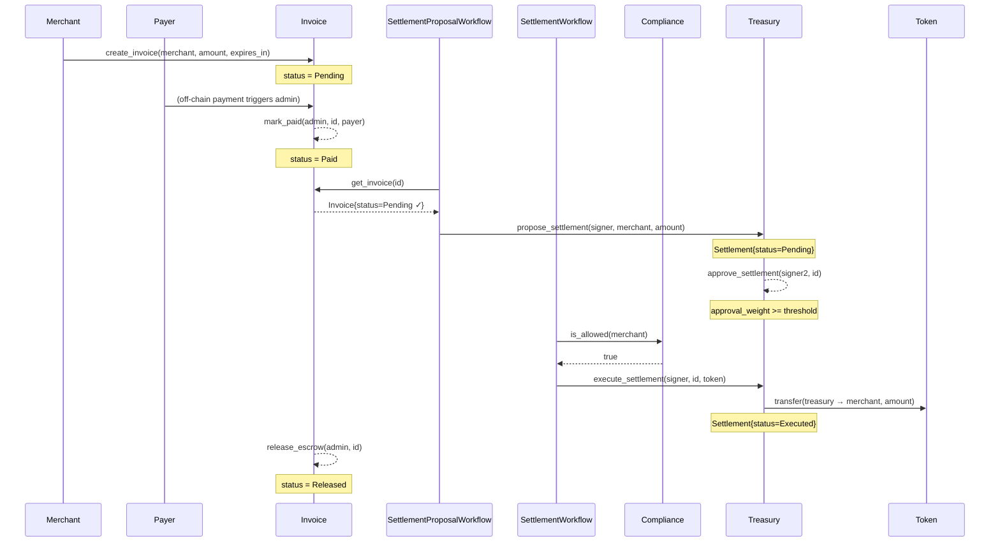

> **Glossary:** For definitions of terms used throughout this document and the contract READMEs, see [`docs/GLOSSARY.md`](docs/GLOSSARY.md).

## Contract Size Budget

The CI size gate (`contract-size.yml`) rejects any compiled WASM that exceeds **65 536 bytes (64 KiB)**.

Rationale:
- Soroban's current network-enforced maximum for a deployed contract WASM is **65 536 bytes**. Deploying a larger binary is rejected at the protocol level, so the CI threshold mirrors the hard ceiling exactly — there is no separate "margin" buffer because any byte over the limit is already a deploy failure.
- The threshold is set via the `MAX_CONTRACT_SIZE` env var in `contract-size.yml` so it can be updated in one place if the network limit changes.
- All three contracts (compliance, invoice, treasury) are currently well under this ceiling. The check exists to catch accidental size regressions before they reach a deploy attempt.

---

# Architecture

This document describes the protocol-level design of the three COMEBACKHERE smart contracts, their data storage, and how they interact during a typical payment lifecycle.

## Contracts

| Contract | Crate path | Responsibility |
|---|---|---|
| **Invoice** | `contracts/invoice` | Invoice state machine and escrow lifecycle |
| **Treasury** | `contracts/treasury` | 2-of-3 multi-sig settlement approval and token transfer |
| **Compliance** | `contracts/compliance` | Admin-managed allow/block list for addresses |

---

## Payment Lifecycle — Mermaid Sequence Diagram


```mermaid
sequenceDiagram
    participant Merchant
    participant Payer
    participant Invoice
    participant SettlementProposalWorkflow
    participant SettlementWorkflow
    participant Compliance
    participant Treasury
    participant Token

    Merchant->>Invoice: create_invoice(merchant, amount, expires_in)
    Note over Invoice: status = Pending

    Payer->>Invoice: (off-chain payment triggers admin)
    Invoice-->>Invoice: mark_paid(admin, id, payer)
    Note over Invoice: status = Paid

    SettlementProposalWorkflow->>Invoice: get_invoice(id)
    Invoice-->>SettlementProposalWorkflow: Invoice{status=Pending ✓}
    SettlementProposalWorkflow->>Treasury: propose_settlement(signer, merchant, amount)
    Note over Treasury: Settlement{status=Pending}

    Treasury-->>Treasury: approve_settlement(signer2, id)
    Note over Treasury: approval_weight >= threshold

    SettlementWorkflow->>Compliance: is_allowed(merchant)
    Compliance-->>SettlementWorkflow: true
    SettlementWorkflow->>Treasury: execute_settlement(signer, id, token)
    Treasury->>Token: transfer(treasury → merchant, amount)
    Note over Treasury: Settlement{status=Executed}

    Invoice-->>Invoice: release_escrow(admin, id)
    Note over Invoice: status = Released
```

> **Note:** `SettlementProposalWorkflow` and `SettlementWorkflow` are off-chain or intermediary contracts that coordinate the cross-contract calls. Treasury does **not** call Compliance directly.

---

## DataKey Storage Reference

### Invoice (`contracts/invoice`)

| DataKey | Storage | Type | Description |
|---|---|---|---|
| `Admin` | Instance | `Address` | Contract administrator |
| `InvoiceCount` | Instance | `u64` | Monotonic invoice ID counter |
| `Paused` | Instance | `bool` | Circuit-breaker flag |
| `GraceWindow` | Instance | `u64` | Seconds added to `expires_at` during `mark_paid` |
| `Invoice(u64)` | Persistent | `Invoice` | Full invoice record keyed by ID |
| `MerchantNonce(Address, u64)` | Persistent | `bool` | Idempotency guard; rejects duplicate merchant nonces |

### Treasury (`contracts/treasury`)

| DataKey | Storage | Type | Description |
|---|---|---|---|
| `Admin` | Instance | `Address` | Contract administrator |
| `Threshold` | Instance | `u32` | Minimum approval weight to execute a settlement |
| `SettlementCount` | Instance | `u64` | Monotonic settlement ID counter |
| `Signer(Address)` | Instance | `u32` | Signing weight per authorized signer |
| `Paused` | Instance | `bool` | Circuit-breaker flag |
| `DisputeCount` | Instance | `u64` | Monotonic dispute ID counter |
| `RotationCount` | Instance | `u64` | Monotonic signer-rotation proposal counter |
| `TokenAllowlist` | Instance | `Vec<Address>` | Approved token contracts for settlement |
| `MerchantPayoutAddress(Address)` | Instance | `Address` | Override payout address per merchant |
| `Settlement(u64)` | Persistent | `Settlement` | Settlement record keyed by ID |
| `Dispute(u64)` | Persistent | `Dispute` | Dispute record keyed by ID |
| `Balance(Address)` | Persistent | `i128` | Deposited balance per depositor |
| `SignerRotation(u64)` | Persistent | `SignerRotationProposal` | Signer rotation proposal keyed by ID |

### Compliance (`contracts/compliance`)

| DataKey | Storage | Type | Description |
|---|---|---|---|
| `Admin` | Instance | `Address` | Contract administrator |
| `PendingAdmin` | Instance | `Address` | Pending admin for two-step transfer |
| `Paused` | Instance | `bool` | Circuit-breaker flag (allow/block ops disabled; `block_address` still permitted) |
| `AddressIndex` | Instance | `Vec<Address>` | Index of all tracked addresses for `export_snapshot` |
| `Allowed(Address)` | Persistent | `bool` | Whether an address is on the allow-list |
| `Blocked(Address)` | Persistent | `bool` | Whether an address is blocked (overrides allow) |
| `AllowedUntil(Address)` | Persistent | `u64` | Optional expiry timestamp for a temporary allow |

## Error-Code Ranges per Contract

Each contract defines error codes via a `#[contracterror]` enum. New variants **must** be appended at the end (highest numeric value) to preserve on-chain backwards compatibility — existing contracts and clients may depend on the current ordinal positions.

### Invoice Contract (`InvoiceError` — range 1..=21)

| Code | Name | Description |
|---|---|---|
| 1 | `Unauthorized` | Caller is not the expected admin or merchant |
| 2 | `ContractPaused` | Contract is paused and the operation is blocked |
| 3 | `InvalidAmount` | Amount is zero, negative, or gross < amount |
| 4 | `NotPending` | Invoice status is not `Pending` for the required transition |
| 5 | `Expired` | Payment window (including grace period) has elapsed |
| 6 | `NotFound` | No invoice exists for the given ID |
| 7 | `AlreadyInitialized` | `initialize` has already been called |
| 8 | `ZeroDuration` | `expires_in_seconds` is zero |
| 9 | `ExpiryOverflow` | `expires_at` arithmetic overflowed `u64` |
| 10 | `NotPaid` | Invoice is not in `Paid` status |
| 11 | `NotReleased` | Invoice has not been released from escrow |
| 12 | `AmountPrecision` | Amount below minimum USDC unit (< 10_000_000 stroops) |
| 13 | `DuplicateNonce` | Merchant nonce has already been used |
| 14 | `ExpiryTooLong` | `expires_in_seconds` exceeds max (5 years) |
| 15 | `MetadataMismatch` | Provided `metadata_hash` does not match stored hash |
| 16 | `NoPendingAdmin` | No pending admin transfer to accept |
| 17 | `InvalidPaymentLinkHash` | `payment_link_hash` is not exactly 32 bytes |
| 18 | `NotRefundRequested` | Invoice is not in `RefundRequested` status |
| 19 | `TokenMismatch` | Provided payment token does not match invoice's expected token |
| 20 | `BatchTooLarge` | Batch input exceeds `MAX_BATCH_SIZE` |
| 21 | `CooldownActive` | `create_invoice` called again before `CreationCooldown` elapsed |

### Treasury Contract (`TreasuryError` — range 1..=17)

| Code | Name | Description |
|---|---|---|
| 1 | `AlreadyInitialized` | `initialize` has already been called |
| 2 | `ZeroThreshold` | Approval threshold cannot be zero |
| 3 | `SettlementNotFound` | No settlement exists for the given ID |
| 4 | `AlreadyExecuted` | Settlement is already executed, cancelled, or expired |
| 5 | `ThresholdNotMet` | Approval weight is below the required threshold |
| 6 | `ThresholdNotConfigured` | Threshold has not been set |
| 7 | `InvalidAmount` | Amount is zero or negative |
| 8 | `ContractPaused` | Contract is paused and the operation is blocked |
| 9 | `Unauthorized` | Caller is not the admin |
| 10 | `UnauthorizedSigner` | Caller is not an authorised signer (zero weight) |
| 11 | `InvalidTokenContract` | Token contract is the treasury itself |
| 12 | `TokenNotAllowed` | Token is not on the settlement allowlist |
| 13 | `RotationNotFound` | No signer rotation proposal for the given ID |
| 14 | `RotationAlreadyExecuted` | Rotation proposal already executed or cancelled |
| 15 | `SettlementOnHold` | Settlement is on hold and cannot be executed |
| 16 | `DisputeNotExpired` | Dispute expiry timestamp has not been reached |
| 17 | `AlreadyOnHold` | Settlement is already on hold |

### Compliance Contract (`ComplianceError` / `ContractError` — range 1..=4)

| Code | Name | Description |
|---|---|---|
| 1 | `Unauthorized` (ContractError) | Caller is not the admin or operator |
| 2 | `ContractPaused` (ContractError) | Contract is paused and the operation is blocked |
| 3 | `AlreadyInitialized` (ContractError) | `initialize` has already been called |
| 4 | `BatchTooLarge` (ContractError) | Batch input exceeds `MAX_BATCH_SIZE` |

> **Note:** `ComplianceError` enum exists separately with code `AlreadyInitialized = 1` for historical compatibility. New error variants should be added to `ContractError`.

---

## Shared Crates — Types, Not Storage

The two shared crates (`crates/multisig` and `crates/protocol-errors`) provide types and error definitions that are imported by the contracts. They are **not deployed contracts** and have **no DataKeys or on-chain storage of their own**.

| Crate | What it provides | Storage |
|---|---|---|
| `crates/multisig` | `SettlementHoldReason` enum, multisig helper types | None |
| `crates/protocol-errors` | Shared error type utilities | None |

If you are looking for where a type like `SettlementHoldReason` is stored on-chain, look at the **Treasury** DataKey table above (`Settlement(u64)` embeds it). The crates themselves are compile-time dependencies only.

---

## Cross-Contract Call Map

```
SettlementProposalWorkflow
  ├── Invoice::get_invoice(id)              → validates status == Pending
  └── Treasury::propose_settlement(...)     → creates Settlement record

SettlementWorkflow
  ├── Compliance::is_allowed(merchant)      → compliance gate (must be true)
  └── Treasury::execute_settlement(...)     → transfers tokens to merchant

Treasury::execute_settlement
  └── Token::transfer(treasury → merchant)  → SEP-41 token transfer

Invoice (standalone — no outbound cross-contract calls)
Treasury (standalone — no outbound cross-contract calls except Token)
Compliance (standalone — no outbound cross-contract calls)
```

### Cross-Contract Compliance Call Failure Modes

Soroban cross-contract calls have no network-style timeout or retry — a call either
returns synchronously within the same transaction or the invocation aborts. This
documents how the calling contract (`Treasury`, via `compliance-client`) reacts to
each failure mode when invoking `Compliance::is_allowed`:

| Failure mode | Behavior | Caller impact |
|---|---|---|
| Compliance contract not deployed / wrong contract ID | The host call fails immediately (no such contract instance) | The calling transaction aborts entirely; all state changes made earlier in the same transaction (e.g. a prior `Treasury` write) are rolled back. There is no partial-execution state to clean up. |
| Compliance contract paused | `is_allowed` does not check the `Paused` flag — only administrative mutations (`allow_address`, `block_address`, etc.) enforce `require_not_paused`. `is_allowed` still executes and returns its normal `bool` result while paused. | No special handling needed; a pause does not block compliance reads, only compliance list mutations. |
| Compliance contract panics (unexpected internal error) | The panic propagates up through the cross-contract call boundary | The calling transaction aborts entirely, identical to a missing-contract failure. Soroban provides no automatic retry — the caller (or off-chain orchestrator driving `SettlementWorkflow`) must resubmit a fresh transaction after the underlying issue is resolved. |

Because there is no retry/backoff primitive at the protocol level, any retry policy
(e.g. re-attempting `execute_settlement` after a transient compliance failure) must
be implemented off-chain by whatever process submits these transactions.

### Invoice Status State Machine

```
Pending ──mark_paid──► Paid ──release_escrow──► Released
   │                     │
   │ cancel_invoice       └── request_refund ──► RefundRequested
   ▼
Cancelled

Pending ──batch_expire──► Expired  (when ledger.timestamp >= expires_at)
```

### Invoice Status Audit Trail

Off-chain indexers reconstruct the chronological status history for each invoice
from the invoice contract's emitted events, using the invoice ID topic as the
stream key. `invoice_created`, `invoice_paid`, `invoice_expired`,
`invoice_cancelled`, `invoice_refund_requested`, and `refund_approved` carry the
resulting full `Invoice`; `escrow_released` carries the invoice ID, merchant,
amount, and release timestamp. Consumers must process events in ledger/event
order, checkpoint their position, and deduplicate replayed events. The current
state can be reconciled with `get_invoice` or the `batch_get_invoice_status`
entrypoint.

---

## Storage Migration Strategy

Soroban has no automatic storage migration. Once a `#[contracttype]` struct is deployed, changing its fields is a breaking change for any data already written under that type.

### Intended approach

**Additive-only field changes** are the default strategy:
- New fields must be wrapped in `Option<T>` so that existing stored values (which lack the field) deserialise without error.
- Removing or reordering fields is forbidden after mainnet deployment.
- Renaming a field is equivalent to removing the old one and adding a new one — treat it as a breaking change.

**Explicit migration entrypoint** (when additive-only is insufficient):
- Add a `migrate(admin: Address)` entrypoint that reads records under the old schema, transforms them, and writes them under the new schema.
- Gate it with `require_auth` on `admin` and a one-time `Migrated` instance-storage flag so it cannot be called twice.
- The entrypoint should be removed (or made a no-op) in a subsequent release once migration is confirmed complete on-chain.

### Per-contract notes

| Contract | Current risk | Notes |
|---|---|---|
| Invoice | `Invoice` struct has grown incrementally; all new fields are `Option<T>` | Follow additive-only going forward |
| Treasury | `Settlement` and `Dispute` structs embed `SettlementHoldReason` from `crates/multisig` | Adding variants to `SettlementHoldReason` is safe; removing or renumbering is not |
| Compliance | Minimal stored types (`bool`, `u64`) | Low migration risk |

---

## Known Limitations

This is a living list of confirmed, intentionally-deferred gaps — things the
team already knows about and has chosen not to fix immediately, as opposed to
undiscovered bugs. It's expected to grow as other in-flight issues land their
findings; each entry links to the issue tracking it.

- **Treasury's panicking entrypoints are only partially converted to
  `Result<T, TreasuryError>`.** The conversion is being done incrementally
  (deposits/signers, disputes/holds, and the remaining panicking entrypoints
  are separate PRs) because doing it in one PR risks pushing `treasury.wasm`
  over the CI size budget. See #385, #386, #387, #388.
- **`SettlementWorkflow`'s precondition that the caller be a registered
  Treasury signer currently surfaces as a generic `Unauthorized` error**
  rather than a specific one identifying the missing signer registration.
  Fixing this requires a documentation/error-message change, tracked
  separately. See #370.
- **Storage TTL / rent-bump policy has not yet been audited** across the four
  contracts. See #402.
- **The economic soundness of Treasury's threshold-vs-signer-count
  relationship (quorum unreachability under signer loss/rotation) has not yet
  had a game-theory review.** See #411.

#117's planned external audit is expected to benefit from this list being
collected here rather than reconstructed from individual issues.
