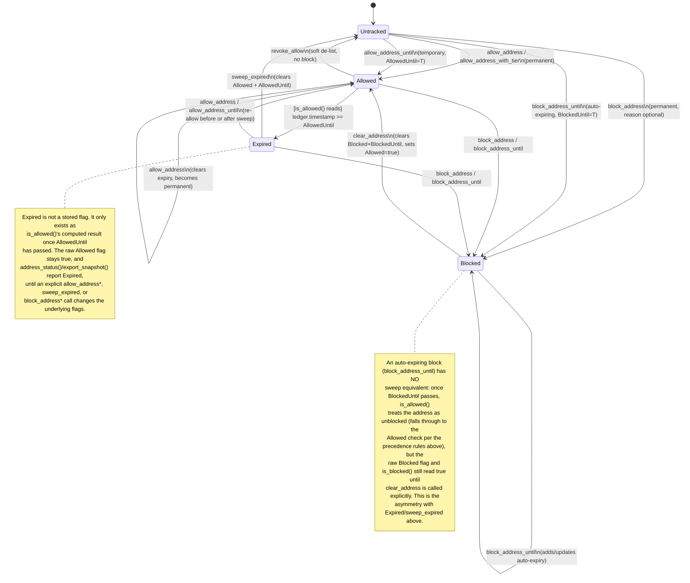

# Compliance Contract

The Compliance contract manages an allowlist of addresses permitted to interact with the system. It supports permanent and temporary (time-bound) allowing, as well as blocking of addresses.

## Entrypoints

| Function | Auth Required | Parameters | Returns | Errors |
|----------|---------------|------------|---------|--------|
| `initialize` | `admin` | `admin: Address` | `Result<(), ContractError>` | `AlreadyInitialized` |
| `is_allowed` | None | `address: Address` | `bool` | None |
| `is_blocked` | None | `address: Address` | `bool` | None |
| `allow_address` | `admin` | `admin: Address, address: Address` | `Result<(), ContractError>` | `Unauthorized`, `ContractPaused` |
| `block_address` | `admin` | `admin: Address, address: Address` | `Result<(), ContractError>` | `Unauthorized` |
| `allow_address_until` | `admin` | `admin: Address, address: Address, expires_at: u64` | `Result<(), ContractError>` | `Unauthorized`, `ContractPaused` |
| `allow_address_with_tier` | `admin` | `admin: Address, address: Address, tier: u32` | `Result<(), ContractError>` | `Unauthorized`, `ContractPaused` |
| `get_address_tier` | None | `address: Address` | `u32` | None |
| `set_jurisdiction` | `admin` | `admin: Address, address: Address, jurisdiction_code: Symbol` | `Result<(), ContractError>` | `Unauthorized`, `ContractPaused` |
| `get_jurisdiction` | None | `address: Address` | `Option<Symbol>` | None |
| `transfer_admin` | `admin` | `admin: Address, new_admin: Address` | `Result<(), ContractError>` | `Unauthorized` |
| `accept_admin` | `new_admin` | `new_admin: Address` | `Result<(), ContractError>` | `Unauthorized` |
| `clear_address` | `admin` | `admin: Address, address: Address` | `Result<(), ContractError>` | `Unauthorized` |
| `pause` | `admin` | `admin: Address` | `Result<(), ContractError>` | `Unauthorized` |
| `unpause` | `admin` | `admin: Address` | `Result<(), ContractError>` | `Unauthorized` |

## CLI usage examples

Replace `$COMPLIANCE_CONTRACT`, `$ADMIN`, `$ADDRESS`, and `$NETWORK` with your deployed values.

### initialize

```sh
stellar contract invoke \
  --id $COMPLIANCE_CONTRACT \
  --source $ADMIN \
  --network $NETWORK \
  -- initialize \
  --admin $ADMIN
```

### allow_address

```sh
stellar contract invoke \
  --id $COMPLIANCE_CONTRACT \
  --source $ADMIN \
  --network $NETWORK \
  -- allow_address \
  --admin $ADMIN \
  --address $ADDRESS
```

### is_allowed

```sh
stellar contract invoke \
  --id $COMPLIANCE_CONTRACT \
  --network $NETWORK \
  -- is_allowed \
  --address $ADDRESS
```

---

## `is_allowed` precedence

`is_allowed` evaluates state in a fixed order, and **Blocked overrides Allowed**:

1. If the address is `Blocked`, `is_allowed` returns `false` — unless a `BlockedUntil`
   timestamp is set and has passed, in which case the block has auto-expired and
   evaluation falls through to step 2.
2. Otherwise, if the address is not `Allowed`, `is_allowed` returns `false`.
3. Otherwise, if an `AllowedUntil` expiry is set, `is_allowed` returns `true` only
   while the current ledger timestamp is strictly less than that expiry.
4. Otherwise (allowed, no expiry), `is_allowed` returns `true`.

This means an address that is both `Allowed` and `Blocked` is treated as blocked;
`clear_address` must be called to restore it to an allowed state.

## `is_blocked`

`is_blocked` returns the raw `Blocked` flag for `address`, independent of `is_allowed`.
Unlike `is_allowed`, it does not consult `BlockedUntil` — a block that has auto-expired
by timestamp still reads as `true` here until `clear_address` (or an equivalent state
change) clears the `Blocked` key.

---

## `AddressState` transition diagram

`AddressState` (`Allowed` / `Blocked` / `Expired`) is the coarse, computed
classification returned by `address_status` and `export_snapshot*` (see
`address_state` internally). It is derived from the raw `Allowed(Address)`,
`Blocked(Address)`, and `AllowedUntil(Address)` storage flags — there is no
separate stored "state" field, so every transition below is really a
transition in those underlying flags. This complements `ARCHITECTURE.md`'s
sequence diagram (which shows *inter*-contract call flow) with the
*intra*-contract state machine for a single tracked address, per #56.



**Reading `Untracked` above:** it is not a real `AddressState` value — the
enum only has `Allowed` / `Blocked` / `Expired`. It stands in here for "no
`Allowed` flag and no `Blocked` flag set," which is how a never-seen address,
or one that was `revoke_allow`'d, reads today. Note that `address_status`
and `export_snapshot*` classify this case as `AddressState::Blocked` (their
`!allowed` fallthrough), even though `is_blocked()` on the same address
returns `false`. Callers relying on `AddressState` alone cannot distinguish
"actually on the blocklist" from "was simply never allowed" — use
`is_blocked` directly when that distinction matters.

### Which entrypoints work while the contract is paused

Per the "Emergency policy" comment in `lib.rs`, `block_address`,
`block_address_until`, `bulk_block_addresses`, and `clear_address` do **not**
call `require_not_paused` — an admin can block or remediate addresses while
the contract is paused, without unpausing first. Every entrypoint that grants
or extends access (`allow_address`, `allow_address_with_tier`,
`allow_address_until`, `bulk_allow_addresses`, `revoke_allow`) does check
`require_not_paused` and is rejected with `ContractPaused` while paused.
`is_allowed` and `is_blocked` themselves are reads and are never gated by
`Paused` at all — see `ARCHITECTURE.md`'s note that a compliance pause only
blocks list *mutations*, not `is_allowed` reads.

| Entrypoint | Permitted while paused? |
|---|---|
| `allow_address`, `allow_address_with_tier`, `allow_address_until`, `bulk_allow_addresses`, `revoke_allow` | No — `ContractPaused` |
| `block_address`, `block_address_until`, `bulk_block_addresses`, `clear_address` | Yes (emergency remediation policy) |
| `is_allowed`, `is_blocked`, `address_status`, `export_snapshot*` | Yes — reads are never gated by `Paused` |
| `sweep_expired` | Yes — no `require_not_paused` call in its implementation |
