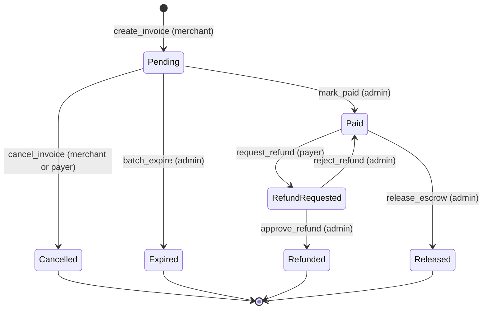

# Invoice Contract

The Invoice contract manages the lifecycle of merchant invoices, from creation to payment and escrow release. It supports merchant-supplied nonces for idempotency, configurable grace windows for payment validity, and admin-controlled escrow releases.

## Invoice state machine

The diagram below shows every invoice status and the entrypoint that moves an
invoice between statuses. It is kept in sync with `src/invoice.rs`; update it in
the same PR as any lifecycle change.

### Roles per transition

| Transition | Entrypoint | Role that can trigger it |
| --- | --- | --- |
| `[*]` → `Pending` | `create_invoice` | merchant |
| `Pending` → `Paid` | `mark_paid` | admin |
| `Pending` → `Cancelled` | `cancel_invoice` | merchant or payer (invoice owner) |
| `Pending` → `Expired` | `batch_expire` | admin |
| `Paid` → `RefundRequested` | `request_refund` | payer |
| `Paid` → `Released` | `release_escrow` | admin |
| `RefundRequested` → `Refunded` | `approve_refund` | admin |
| `RefundRequested` → `Paid` | `reject_refund` | admin |

`Cancelled`, `Expired`, `Refunded` and `Released` are terminal statuses.

## Entrypoints

| Function             | Auth Required | Parameters                                                                                                                                                       | Returns                               | Errors                                                                                                    |
| -------------------- | ------------- | ---------------------------------------------------------------------------------------------------------------------------------------------------------------- | ------------------------------------- | --------------------------------------------------------------------------------------------------------- |
| `initialize`         | `admin`       | `admin: Address`                                                                                                                                                 | `Result<(), InvoiceError>`            | `AlreadyInitialized`                                                                                      |
| `set_grace_window`   | `admin`       | `admin: Address, seconds: u64`                                                                                                                                   | `Result<(), InvoiceError>`            | `Unauthorized`, `ContractPaused`                                                                          |
| `get_grace_window`   | None          | None                                                                                                                                                             | `u64`                                 | None                                                                                                      |
| `get_invoice_count`  | None          | None                                                                                                                                                             | `u64`                                 | None                                                                                                      |
| `create_invoice`     | `merchant`    | `merchant: Address, amount_usdc: i128, gross_usdc: i128, expires_in_seconds: u64, metadata_hash: MaybeBytes, payment_link_hash: MaybeBytes, merchant_nonce: u64` | `Result<u64, InvoiceError>`           | `ContractPaused`, `InvalidAmount`, `InvalidPrecision`, `ZeroDuration`, `DuplicateNonce`, `ExpiryOverflow` |
| `mark_paid`          | `admin`       | `admin: Address, id: u64, payer: Address`                                                                                                                        | `Result<(), InvoiceError>`            | `Unauthorized`, `ContractPaused`, `NotFound`, `NotPending`, `Expired`                                     |
| `release_escrow`     | `admin`       | `admin: Address, id: u64`                                                                                                                                        | `Result<(), InvoiceError>`            | `Unauthorized`, `ContractPaused`, `NotFound`, `NotPaid`                                                   |
| `get_invoice`        | None          | `id: u64`                                                                                                                                                        | `Result<Invoice, InvoiceError>`       | `NotFound`                                                                                                |
| `get_invoice_status` | None          | `id: u64`                                                                                                                                                        | `Result<InvoiceStatus, InvoiceError>` | `NotFound`                                                                                                |
| `batch_get_invoice_status` | None    | `ids: Vec<u64>`                                                                                                                                                  | `Vec<Result<InvoiceStatus, InvoiceError>>` | Per-ID `NotFound`                                                                                     |
| `cancel_invoice`     | `caller`      | `caller: Address, id: u64`                                                                                                                                       | `Result<(), InvoiceError>`            | `Unauthorized`, `ContractPaused`, `NotFound`, `NotPending`                                                |
| `batch_expire`       | `admin`       | `admin: Address, ids: Vec<u64>`                                                                                                                                  | `Result<u32, InvoiceError>`           | `Unauthorized`                                                                                            |
| `request_refund`     | `payer`       | `payer: Address, id: u64`                                                                                                                                        | `Result<(), InvoiceError>`            | `Unauthorized`, `ContractPaused`, `NotFound`, `NotPaid`                                                   |
| `reject_refund`      | `admin`       | `admin: Address, id: u64`                                                                                                                                        | `Result<(), InvoiceError>`            | `Unauthorized`, `ContractPaused`, `NotFound`, `NotRefundRequested`                                        |
| `pause`              | `admin`       | `admin: Address`                                                                                                                                                 | `Result<(), InvoiceError>`            | `Unauthorized`                                                                                            |
| `unpause`            | `admin`       | `admin: Address`                                                                                                                                                 | `Result<(), InvoiceError>`            | `Unauthorized`                                                                                            |

## Merchant nonce lifecycle

`merchant_nonce` is an idempotency key scoped to the merchant address. A value of
`0` disables nonce enforcement. Every non-zero nonce is permanently consumed by
a successful invoice creation: cancelling or expiring the invoice does not delete
the `MerchantNonce` storage entry, so a later creation by the same merchant with
that nonce returns `DuplicateNonce`. Different merchants may use the same nonce.

## Reconstructing status history

Off-chain indexers should reconstruct invoice status history from contract events,
ordered by ledger sequence and event position. Use the invoice ID in the second
event topic as the stream key:

| Event | Status represented | Data |
| --- | --- | --- |
| `invoice_created` | `Pending` | Full `Invoice` |
| `invoice_paid` | `Paid` | Full `Invoice` |
| `invoice_expired` | `Expired` | Full `Invoice` |
| `invoice_cancelled` | `Cancelled` | Full `Invoice` |
| `invoice_refund_requested` | `RefundRequested` | Full `Invoice` |
| `refund_approved` | `Refunded` | Full `Invoice` |
| `refund_rejected` | `Paid` (reverted from `RefundRequested`) | Full `Invoice` |
| `escrow_released` | `Released` | `EscrowReleasedEvent { id, merchant, amount_usdc, released_at }` |

Indexers should checkpoint the last processed ledger/event position, replay from
that checkpoint after interruptions, and deduplicate by transac

/* … truncated 1465 chars — edit only what you need near the top … */
