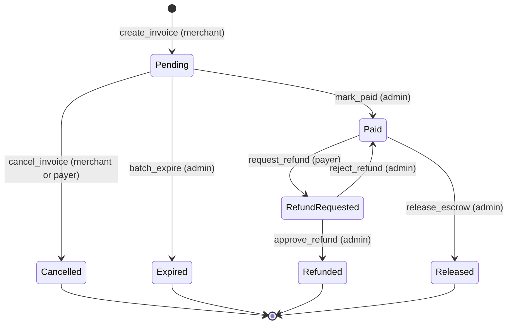

# Invoice Contract

The invoice contract manages invoice creation, payment, and merchant-scoped
invoice queries.

## Invoice state machine

The diagram below shows every invoice status and the entrypoint that moves an
invoice between statuses. It is kept in sync with `src/invoice.rs`; update it in
the same PR as any lifecycle change.

### Roles per transition

| Transition | Entrypoint | Role that can trigger it |
| --- | --- | --- |
| `[*]` → `Pending` | `create_invoice` | merchant |
| `Pending` → `Paid` | `mark_paid` | admin |
| `Pending` → `Cancelled` | `cancel_invoice` | merchant or payer (invoice owner) |
| `Pending` → `Expired` | `batch_expire` | admin |
| `Paid` → `RefundRequested` | `request_refund` | payer |
| `Paid` → `Released` | `release_escrow` | admin |
| `RefundRequested` → `Refunded` | `approve_refund` | admin |
| `RefundRequested` → `Paid` | `reject_refund` | admin |

`Cancelled`, `Expired`, `Refunded` and `Released` are terminal statuses.

## Entrypoints

### `get_invoices_by_merchant(merchant)`

## Batch creation atomicity

`batch_create_invoice` is **all-or-nothing**. Every entry in the batch is
validated up front — amounts, precision, due dates, merchant authorization,
nonce uniqueness, and batch caps — before any invoice is persisted. If any
entry fails validation, the call returns the corresponding typed
`InvoiceError` and no state is written: the invoice count, pending index, and
merchant index are left exactly as they were before the call. Integrators can
therefore treat a failed batch as a no-op and retry the whole batch after
correcting the offending entry.

## Merchant nonce lifecycle

Returns all invoices belonging to `merchant`.

### `get_invoices_by_merchant_page(merchant, cursor, limit)`

Cursor-paginated replacement for `get_invoices_by_merchant`. Returns a bounded
page of invoices for `merchant`.

- `merchant`: the merchant whose invoices are being queried.
- `cursor`: opaque pagination cursor. Pass `None` (or the contract's empty
  cursor value) to start from the beginning; pass the cursor returned by the
  previous page to fetch the next page.
- `limit`: maximum number of invoices to return in this page. The contract caps
  this value, so callers may request a large `limit` but will never receive more
  than the configured maximum per call.

Indexers should checkpoint the last processed ledger/event position, replay from
that checkpoint after interruptions, and deduplicate by transac

/* … truncated 1465 chars — edit only what you need near the top … */
